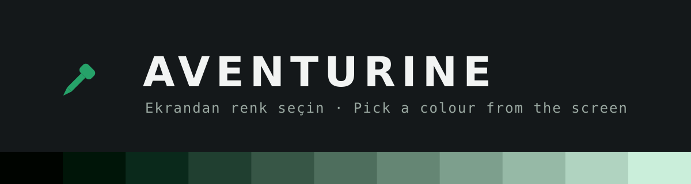

<div align="center">



# AVENTURINE

[](https://github.com/sudo-megas/AVENTURINE/releases/tag/v1.0)
[](https://github.com/sudo-megas/AVENTURINE/releases/tag/v1.0)
[](LICENSE)

[](https://github.com/sudo-megas/AVENTURINE/releases/tag/v1.0)
[](https://github.com/sudo-megas/AVENTURINE/releases/tag/v1.0)

**Ekrandan renk seçin. Piksele tıklayın, o rengin bilmeye değer her gösterimini alın.**

**Pick a colour from the screen. Click a pixel, get every representation of that colour worth having.**

</div>

---

## 1. DESCRIPTION

`aventurine` is a screen colour picker for Linux. You press the pick button, your compositor's own colour-picker crosshair appears, you click a pixel, and the window fills with:

- **fourteen** textual representations of that colour
- contrast ratios against white and black with WCAG verdicts
- a strip of five tints and five shades, generated in OKLCH
- a running history of everything picked, capped at 100 entries

Every row is click-to-copy. **Nothing is copied automatically.**

The design constraint that shapes everything else is that the application must keep working when the desktop underneath it changes. It talks to standardised interfaces, never to a specific compositor. Moving from Niri to KDE changes which capture backend answers and nothing else in the program notices.

Two things it will never do:

- **No telemetry, analytics, crash reporting, or data collection of any kind.**
- **No network access.** The binary opens no socket. There is no update check, no remote palette service, no link fetching. This is why the addresses on the about page are selectable text rather than links — the application opens no browser.

---

## 2. DEPENDENCIES

The runtime dependency list is two libraries, and both of them do real work.

| Dependency | Why it is genuinely needed |
|---|---|
| `gtk4` | The entire user interface. It also carries `GdkPixbuf`, which decodes the PNG and JPEG files the image backend reads and gives direct access to their pixels, and `Gdk.Clipboard`, which is how a colour reaches your clipboard and how a pasted screenshot arrives. |
| `glib2` | Provides `GLib` and `GIO`. `GIO` carries the D-Bus client used to talk to the desktop portal, so no separate D-Bus library is required either. |

Build-time only: `vala`, `pkgconf`, `make`, `gcc`.

Both runtime libraries are already present on any system that runs a single GTK application, so in practice this installs into an existing desktop with no new libraries at all.

The packages declare two more — `libcairo` and `libgdk-pixbuf` — because the binary links them directly, for drawing swatches and for reading image pixels. They are not additional choices: both arrive inside the GTK stack and are already installed wherever `gtk4` is. What a project depends on and what a package must declare are different questions, and the packaging answers the second one honestly.

### Why there is no `libportal`

`libportal` is the obvious thing to reach for, and it is deliberately absent.

The application makes exactly **two** kinds of portal call: `org.freedesktop.portal.Screenshot.PickColor` to pick a colour, and `org.freedesktop.portal.Settings.ReadOne` to follow your light or dark preference. Each is a single D-Bus method plus one signal subscription, written directly against `GIO`'s D-Bus client in a few dozen lines that are in this repository and readable.

Adding `libportal` would buy roughly forty lines of convenience and cost a runtime dependency, a version floor, and a second place for portal behaviour to be defined. A dependency should do real work. That one would not.

---

## 3. INSTALLATION

### 3.A From source

```bash
git clone https://github.com/sudo-megas/AVENTURINE
cd AVENTURINE
make
sudo make install
```

`make install` honours `DESTDIR` and `PREFIX`:

```bash
make install DESTDIR=/tmp/stage PREFIX=/usr
```

Run the test suite with `make test`, and remove it again with `sudo make uninstall`.

### 3.B Arch Linux

Download `aventurine-1.0-1-x86_64.pkg.tar.zst` from the [releases page](https://github.com/sudo-megas/AVENTURINE/releases/tag/v1.0):

```bash
sudo pacman -U aventurine-1.0-1-x86_64.pkg.tar.zst
```

Or build it yourself from the `PKGBUILD` in this repository:

```bash
cd packaging/arch && makepkg -si
```

### 3.C Debian and Ubuntu

Download `aventurine_1.0-1_amd64.deb` from the [releases page](https://github.com/sudo-megas/AVENTURINE/releases/tag/v1.0):

```bash
sudo dpkg -i aventurine_1.0-1_amd64.deb
```

If `dpkg` reports missing dependencies, pull them in with `sudo apt-get install -f`.

---

## 4. HOW TO USE? WHAT IS THE APPLICATION SECTIONS?

Launch it from your application menu, or run `aventurine`. The window is a single vertical column, and every part of it does one thing.

| Section | What it does |
|---|---|
| **Header swatch** | The picked colour, filling the top of the window, with its hex printed over it. The text flips between black and white depending on whether the colour's relative luminance is above 0.179, so it stays readable on anything. Before you have picked anything it shows a neutral placeholder rather than pretending you picked black. |
| **Pick button** | Starts a pick. On a desktop with a working portal this hands you the compositor's own crosshair. If only the image backend is available the button says so, and opens the image picker instead. |
| **Format rows** | The fourteen representations: HEX, RGB, RGB percent, HSL, HSV, HWB, CMYK, linear RGB, LAB, LCH, OKLCH, relative luminance, nearest CSS colour name, nearest xkcd colour name. Click any row to copy that value. |
| **Contrast** | The ratio of the picked colour against white and against black, each with four WCAG verdicts — AA at 4.5:1, AA large at 3:1, AAA at 7:1, AAA large at 4.5:1. Each badge carries a tick or a cross as well as a colour, so the verdict never depends on being able to tell green from red. |
| **Tints and shades** | Eleven swatches: five shades, the picked colour in the middle, five tints. They are generated in OKLCH by holding chroma and hue and moving lightness only, so the whole strip stays recognisably the same colour. Clicking a swatch copies its hex; it does **not** become the current colour. |
| **History** | Everything you have picked, newest first, capped at 100 entries and kept in `~/.config/aventurine/history.toml`. Each row shows a swatch, the hex and how long ago it was picked. Click a row to copy it, or use the delete control that appears when you hover it. |
| **Menu → Export** | Writes the whole history out as either a GIMP palette (`.gpl`) or a block of CSS custom properties (`.css`). The suffix you type picks the format. |
| **Menu → Clear history** | Empties the history, after asking. |
| **Menu → About** | Maker, version, release date, source address, which capture backend is actually in use, and the full text of the licence. |

### 4.A Keyboard

| Key | Action |
|---|---|
| `Space` or `Ctrl+P` | Pick |
| `Ctrl+C` | Copy hex |
| `1` to `9` | Copy the value of that numbered format row |
| `Ctrl+Shift+C` | Clear history, with confirmation |
| `Ctrl+E` | Export |
| `Escape` | Close window |

### 4.B Binding a key in your compositor

There is deliberately **no global hotkey built in** — see 4.C. Bind `aventurine` in your compositor's own configuration instead.

**Niri** — `~/.config/niri/config.kdl`:

```kdl
binds {
    Mod+Shift+C { spawn "aventurine"; }
}
```

**Hyprland** — `~/.config/hypr/hyprland.conf`:

```ini
bind = SUPER SHIFT, C, exec, aventurine
```

**KDE Plasma** — System Settings → Keyboard → Shortcuts → Add New → Command or Script, set the command to `aventurine` and give it the shortcut you want.

**GNOME** — either Settings → Keyboard → View and Customise Shortcuts → Custom Shortcuts, or from a terminal:

```bash
KEY=/org/gnome/settings-daemon/plugins/media-keys/custom-keybindings/aventurine/
gsettings set org.gnome.settings-daemon.plugins.media-keys custom-keybindings "['$KEY']"
gsettings set org.gnome.settings-daemon.plugins.media-keys.custom-keybinding:$KEY name 'Aventurine'
gsettings set org.gnome.settings-daemon.plugins.media-keys.custom-keybinding:$KEY command 'aventurine'
gsettings set org.gnome.settings-daemon.plugins.media-keys.custom-keybinding:$KEY binding '<Super><Shift>c'
```

### 4.C Things worth knowing before you file a bug

These are all deliberate, and all of them are consequences of doing this without tying the application to one desktop.

- **There is no magnifier lens.** The portal hands back one colour and nothing else — the application never receives the surrounding pixels, so it has nothing to magnify. Your compositor's own crosshair is used instead, and on most desktops that crosshair has a zoom of its own. A lens would require the application to own a frozen copy of the screen, which is a capture layer that is designed but deliberately not in v1.0.
- **Values are treated as sRGB, with no colour profile.** `PickColor` returns three numbers with no profile attached; there is no way to know which display they came from or what that display's profile is. On a wide-gamut panel — a QD-OLED, for instance — the numbers shown here will not match what a colour-managed application reports for the same pixel. This is a limit of the interface, not of the arithmetic.
- **LAB and LCH use a D65 white point, not CSS's D50.** Values shown here will differ slightly from what a browser prints for `lab()`. D65 is used for internal consistency with the sRGB working space that every other row is derived from.
- **Out-of-gamut ramp entries are clamped, not gamut-mapped.** Pushing a saturated colour towards white can leave sRGB; v1.0 clamps each channel, which is why the very lightest tint of a vivid colour can shift hue slightly. Chroma reduction toward the gamut boundary is the perceptually correct answer and is a candidate for a later version.
- **The nearest colour name is the nearest one, not the prettiest one.** Matching runs in OKLab with plain Euclidean distance. Sometimes the honest answer is `darkgray` when you were hoping for `lightsteelblue`.
- **There is no global hotkey.** That needs the GlobalShortcuts portal and a session service running in the background. Binding a key in your compositor, as above, does the same job with nothing running.

### 4.D What it does with your data

Everything, in full:

- It writes the colours you pick to `~/.config/aventurine/history.toml` (or `$XDG_CONFIG_HOME/aventurine/history.toml`). That file holds an uppercase hex value, a timestamp and the name of the backend that captured it. Nothing else.
- It writes to your clipboard, and **only** when you click a row or press a copy shortcut.
- It writes a palette file where you tell it to, when you use Export.

That is the complete list. It opens no socket, contacts no server, reads no other file of yours, and reports nothing anywhere. If you delete `~/.config/aventurine`, the application has no memory of you at all.

### 4.E When something is not working

```bash
aventurine --doctor
```

That prints the capture backend ladder with a verdict for each rung, and which one was chosen:

```text
aventurine 1.0
session type   wayland
portal owner   org.freedesktop.portal.Desktop present
Screenshot     version 2
  portal       ok
  image        ok
selected       portal
```

If the portal rung says `unavailable`, your desktop has no portal backend implementing `PickColor`, and picking from an image is still available. `AVENTURINE_SOURCE=portal` or `AVENTURINE_SOURCE=image` forces one backend and skips probing; it is the only environment variable the application reads.

---

## 5. LICENCE SUMMARY

AVENTURINE is released under the **GNU General Public License, version 3 or later**. The full text is in [`LICENSE`](LICENSE), and also inside the application's about page.

In short, and without replacing the licence itself:

- You may **use** it for anything, including commercially.
- You may **study** it and **change** it — the source is all here.
- You may **share** it, changed or unchanged.
- If you distribute it, changed or not, you must pass on the same freedoms: ship the source, keep it under GPL-3.0-or-later, and state what you changed.
- There is **no warranty**.

---

<div align="center">

Copyright © 2026 sudo-megas

*Built to outlive the desktop it was written on.*

</div>
